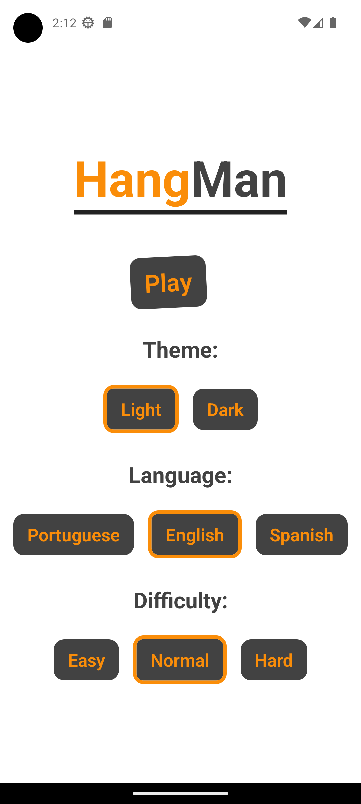
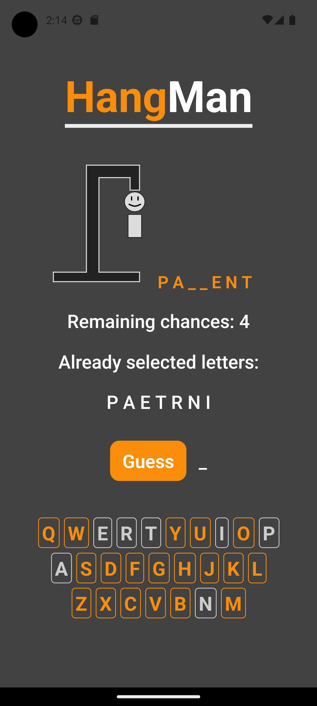
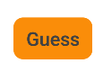
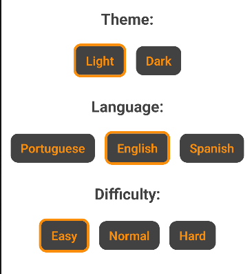
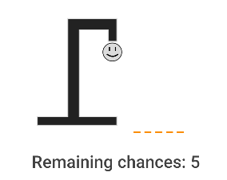
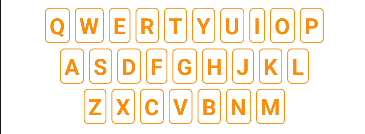
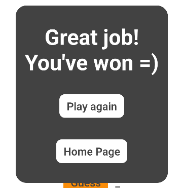
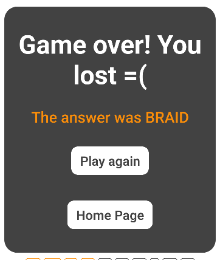

# HangMan Mobile

## Video Demo:  <URL HERE>

### Project Description

My project is a mobile game developed in JavaScript with ReactNative, a famous library used to create flexible mobile applications to both Android and iOS. The game is available in three different languages: english, portuguese and spanish and helps a lot to learn new words in different languages. The secret word is selected randomly using a website called <https://www.palabrasaleatorias.com/>, which can generate random words in many languages.  

---

### Pages

> Homepage

Contains all the settings, there you can choose the language, the difficulty and also the theme of the app, which can be light or dark.

---

> Game

Contains the game itself, showing your current progress, the letters you have selected, a keyboard and a button to guess new letters. With also an illustration showing how many chances you still have.

---

## Project folder structure

- assets: contains the splash art and the icons for the app.
- project-images: has images illustrating the project.
- src: contains all the source code
  
  - assets: has the SVGs used in the components
  - components: encapsulates tags to reuse code
  - contexts: keep track of global variables, for example, the current language or difficulty
  - data: has arrays of words that are used if the website used to generate random words is down, also contains all the texts of the application, which are all encapsulated in one place, this is what makes changing languages possible
  - service: contains auxiliary functions, like generating the secret word by accessing the web or getting the texts based on the language
  - types: contains enums that replace hard-coded values, for example the name of each language, the possible states of the game and the difficulties available
  - views: has both of the pages of the app

---

## Features

### Animated components

Both of the pages are animated when they are rendered for the first time, other components like the play button and the play again button have an infinite animation, to encourage the user to click on them and play more. The loading component is a special case, since it's animated to show the user the app didn't lag or crash. To make it possible, I used the react-native-animatable library, which can create nice animations quite simply.

### Light and Dark themes

The app has a file called globalStyle.js, which contains variables related to the colors that will be used by the components, the catch is that there are two variables with the same properties, one to each theme. So by using the context API of react and the dynamic StyleSheet creation, we can get dynamic styles based on the chosen theme.

### Switching language

The game is available in three languages, to make that possible I encapsulated all the texts of the application in the texts.js file in the data folder, so if I want to add another language, I can easily add one more language by creating another entry in the texts dictionary and adding all the properties related to each sample of text. The context API keeps track of the current language, so the other components can access it and call the function getTexts from /service/getTexts.js to get the texts related to the right language.

### Choosing difficulties

With three possible difficulties, there's an enum in the types folder containing not only a string representing them, but also the number of chances you have based on that difficulty, which will change the visual representation on the game page.

### Random word generation

As mentioned above, the website <https://www.palabrasaleatorias.com/> can generate random words in different languages, so based on the current one the function in generateSecretWord.js will behave accordingly, using the proper url to send a request to the website, through the axios library, which is simpler and more powerful than the fetch function we have natively. Then we can search in the response HTML to find the generated word and return it. However, what if the website is down or the user is offline? Then the app will work as well, because there's a big array of words in those three languages stored in the data folder, which will be used in situations like this, by getting a random index of the array and returning the word stored there.

### Hangman Game

The game works based on many React States, which are special variables that can make a rendered component update and rerender when changed. So I keep track of: the secret word, the letter that was selected with the keyboard, an array of the letters which were already selected, the number of errors, the current state of the game (won, lost or not finished) and your current progress. As spanish and portuguese have non ASCII characters, when comparing the secret word with the letter you chose, a normalize function is called to guarantee it will recognize all characters, even with accents. If the number of errors surpasses the number of chances you lose, but if you manage to find all the letters in the secret word, then you win.

### Dynamic Illustration

The game page contains a SVG image representing your current number of errors, this component receives the errors by props (parameters of a component) and renders a different SVG based on the errors and also the difficulty you are playing in. There are six stages, each containing more parts of the player's body as you commit more mistakes, but if you're playing in a higher difficulty, some stages will be skipped. The catch is that React Native does not support SVGs by default, that's why it's the libraries react-native-svg and react-native-svg-transformer, alongside with the configuration file metro.config.js, to enable the compilation of SVGs. The app also needs Babel, which is a JavaScript compiler that can solve compatibility problems between common js (older and uses require and module.exports) and module js (newer and uses import and export).

---

### Components

Using components is a great way to avoid code repetition, those are the components I used in the application:

#### Button - Generic and Customizable

#### Logo

#### Selection Menu

#### Game Image and Text - Illustrates your performance

#### Keyboard

#### Final Screen (when you win)

#### Final Screen (when you lose)

---

### Courses that helped me learn React Native

<https://cursos.alura.com.br/formacao-react-native>

---

### That's it =)

- My GitHub profile: <https://github.com/BrenoMorim>
- My Linkedin: <https://www.linkedin.com/in/brenomorim/>
